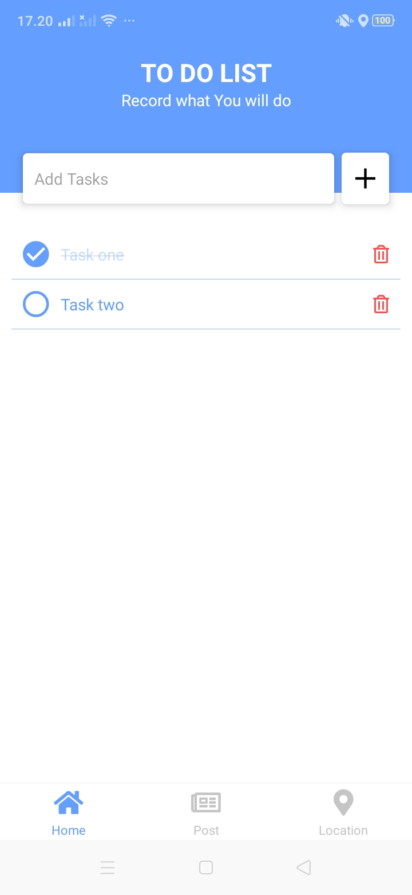
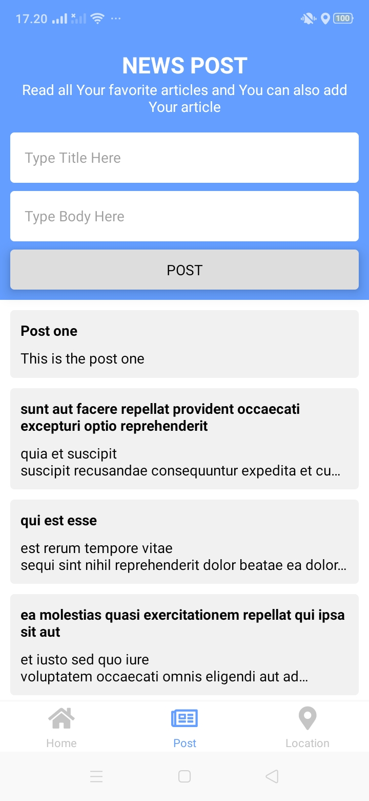
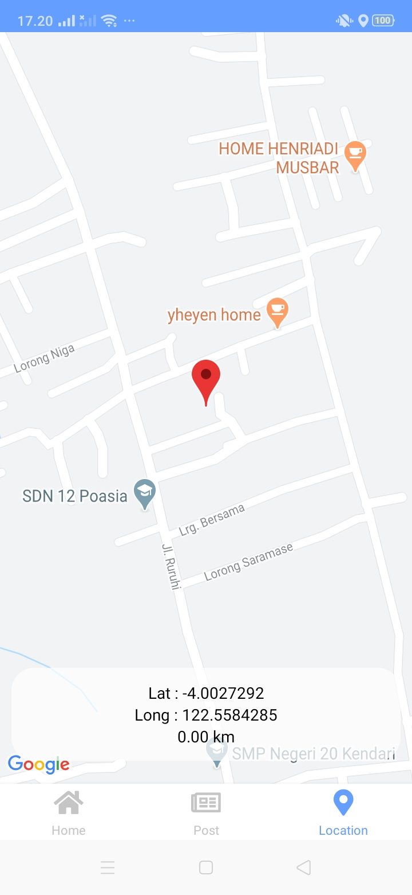

# To do List App

To do list app is application to management what you will do, and you can read and post article and also see curently your location.

# Screenshot



# Installation & Setup
- Installation

```bash
# Yarn :
$ yarn install

# npm :
$ npm install
```
- Run
  
```bash
$ npx react-native run-android
# or
$ npm run android
```

